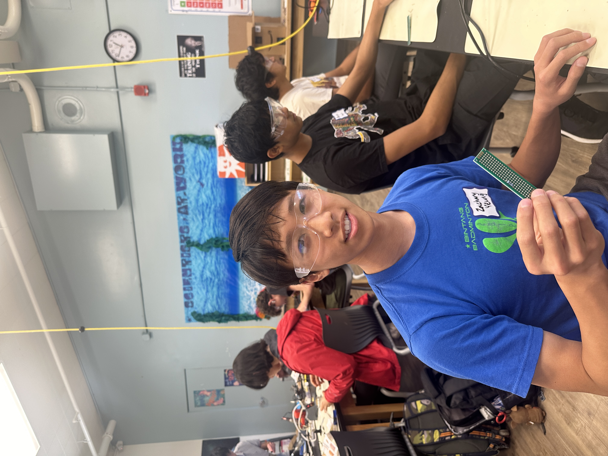

# Ball Tracking Robot
<!-- Replace this text with a brief description (2-3 sentences) of your project. This description should draw the reader in and make them interested in what you've built. You can include what the biggest challenges, takeaways, and triumphs from completing the project were. As you complete your portfolio, remember your audience is less familiar than you are with all that your project entails! 
-->

Instructors are really pro

The ball tracking robot uses object tracking to follow the ball. With the use of the Python Library, OpenCV, the camera can recognize faces, detect objects, and much more. This project uses a Raspberry Pi, Pi Camera, Motor Driver to control the motors, DC Motors to control the wheels, and a Ultrasonic Sensor to avoid object collision.


<!-- You should comment out all portions of your portfolio that you have not completed yet, as well as any instructions:-->
  
<!--- This is an HTML comment in Markdown -->
<!--- Anything between these symbols will not render on the published site -->


| **Engineer** | **School** | **Area of Interest** | **Grade** |
|:--:|:--:|:--:|:--:|
| Zachary Yeung | Lynbrook High School | Engineering | Incoming Sophmore


  
<!-- # Final Milestone

**Don't forget to replace the text below with the embedding for your milestone video. Go to Youtube, click Share -> Embed, and copy and paste the code to replace what's below.**

<iframe width="560" height="315" src="https://www.youtube.com/embed/F7M7imOVGug" title="YouTube video player" frameborder="0" allow="accelerometer; autoplay; clipboard-write; encrypted-media; gyroscope; picture-in-picture; web-share" allowfullscreen></iframe>

For your final milestone, explain the outcome of your project. Key details to include are:
- What you've accomplished since your previous milestone
- What your biggest challenges and triumphs were at BSE
- A summary of key topics you learned about
- What you hope to learn in the future after everything you've learned at BSE
-->


<!-- # Second Milestone

**Don't forget to replace the text below with the embedding for your milestone video. Go to Youtube, click Share -> Embed, and copy and paste the code to replace what's below.**

<iframe width="560" height="315" src="https://www.youtube.com/embed/y3VAmNlER5Y" title="YouTube video player" frameborder="0" allow="accelerometer; autoplay; clipboard-write; encrypted-media; gyroscope; picture-in-picture; web-share" allowfullscreen></iframe>

For your second milestone, explain what you've worked on since your previous milestone. You can highlight:
- Technical details of what you've accomplished and how they contribute to the final goal
- What has been surprising about the project so far
- Previous challenges you faced that you overcame
- What needs to be completed before your final milestone 
-->

# First Milestone

<iframe width="560" height="315" src="https://www.youtube.com/embed/iaNKyVHkxec?si=Xjp5Ty7hhWd-078Z" title="YouTube video player" frameborder="0" allow="accelerometer; autoplay; clipboard-write; encrypted-media; gyroscope; picture-in-picture; web-share" referrerpolicy="strict-origin-when-cross-origin" allowfullscreen></iframe>

## Summary
My first milestone is wiring up all the components of the robot and making sure that it work. The components I used are the Raspberry Pi, DC motors, a motor driver, ultrasonic sensors, and a PiCamera. The Raspberry Pi controls all the components, the DC motors spin in certain directions, the motor driver amplifies current to the DC motors, the ultrasonic sensors calculates distance, and the PiCamera is a camera. Right now, the motors spin, the PiCamera works fine, and the ultrasonic sensors work. Later on I will write code so that it will track a ball using the PiCamera and if the ball moves, the robot will follow it. I will also use the ultrasonic sensors to avoid crashing into obstacles like the ball. 

## Challenges
One challenge I faced during the first milestone was setting up the Raspberry Pi. I was confused because not only did you have to set up the MicroSD card but you also had to download certain softwares to display the Raspberry Pi on a device. I also had a hard time setting up the SSH for the Raspberry Pi, which is a way to connect the command promt on your computer to the Raspberry Pi terminal. Everytime I tried connecting to the Raspberry Pi through SSH, it would say that it cannot find the Raspberry Pi. 

## What's Next?
For the next milestone, I will code ball tracking, and making sure that the robot follows if the ball moves.


# Starter Project

## Summary
For my starter project, I created the game console. I chose this project because it seemed coolest out of all the starter projects. This game console includes Tetris, Snake, Racing, Space Invaders, and Slots. How this game console works is whenever a button is pressed, it sends a signal to the chip, which is then displayed on the LED dot matrix. The red switch is used to turn on the console, the yellow button is used pause the game, the green button starts the game, and the blue buttons controls the LEDs. 

## Challenges
A challenge when creating this starter project is soldering. I accidentally burnt some parts with the soldering iron, but my game console still works. To avoid this, pay attention to what your soldering iron is touching. 

<iframe width="560" height="315" src="https://www.youtube.com/embed/jPP67IPjiLI?si=dl3Rb8Yc3AZLC_-7" title="YouTube video player" frameborder="0" allow="accelerometer; autoplay; clipboard-write; encrypted-media; gyroscope; picture-in-picture; web-share" referrerpolicy="strict-origin-when-cross-origin" allowfullscreen></iframe>

<!-- # Schematics 
Here's where you'll put images of your schematics. [Tinkercad](https://www.tinkercad.com/blog/official-guide-to-tinkercad-circuits) and [Fritzing](https://fritzing.org/learning/) are both great resoruces to create professional schematic diagrams, though BSE recommends Tinkercad becuase it can be done easily and for free in the browser. 

# Code
Here's where you'll put your code. The syntax below places it into a block of code. Follow the guide [here]([url](https://www.markdownguide.org/extended-syntax/)) to learn how to customize it to your project needs. 

```c++
void setup() {
  // put your setup code here, to run once:
  Serial.begin(9600);
  Serial.println("Hello World!");
}

void loop() {
  // put your main code here, to run repeatedly:

}
```
-->

# Bill of Materials

| **Part** | **Note** | **Price** | **Link** |
|:--:|:--:|:--:|:--:|
| Canakit | Contains Raspberry Pi 4 Model B, USB-C power supply, USB MicroSD card reader, MicroSD card, Micro HDMI to HDMI Cable, USB-C PiSwitch, and a case to hold the Raspberry Pi | $119.99 | <a href="https://www.amazon.com/CanaKit-Raspberry-4GB-Starter-Kit/dp/B07V5JTMV9/ref=sr_1_4?crid=22X0E9O7J0OR7&dib=eyJ2IjoiMSJ9.4wZGiZcG7IfVeIs8ylcbr2OWb6dH50gzNdgVi5k-In6pZ99iy8liii7M868UpE97GOIE-tJXQ5sL2XcKGA1wfI3W6mEWsgK1idpK8oIafYN0mPwGntfbsrb3OPGDrrX_z_IS2KvZHiD7YuKDlCT3yoBjG8MgoEI2mzIFUcrNXi1b6c5wWa4Xqelg7oT0q23ZSCpLWxLI0gNwJZzD2KRFfstDIQSowiGKue1IxIrNLrDMGPsu5nPkHQfMaD2q6Fg0okZFAKlMpuxR8LUT6OFyvHql6sTdWpX5KHS5CKILFRI.3BQRKh7cMpx9AbLHH4-SPcHXiP2O2R9GGyI4xqScCfg&dib_tag=se&keywords=raspberry%2Bpi%2B4&qid=1718655031&s=electronics&sprefix=raspberry%2Bpi%2B4%2B%2Celectronics%2C181&sr=1-4&th=1"> Link </a> |
| 4 L298n motor drivers | Controls the DC motor | $9.99 | <a href="https://www.amazon.com/BOJACK-H-Bridge-Controller-Intelligent-Mega2560/dp/B0C5JCF5RS/ref=sr_1_4?crid=23DST39Q577P8&dib=eyJ2IjoiMSJ9.SUwZQBGEhgO-mVLMGJaDlCUDqIV_oiFZsqgrdyMhBBXjgOelzUnGWWEp_An1L0-GmkQAr2J3MIAKIjnGLYk0aHOAHd90jdDYlzI4ytEMfDW7P5UH6mIOKJl2hzLmGOUGISu2N2N7HeHcsLIXxVn0pQKMyIFfcOkBGchxHFqDqVt0C8IutcXgjigRpoTXAP6gyQedtSbWR_ZZLFf4dUfcl4sdgScCQsgaPK_B0a5ZTZw7xEUoEJPPV4ATW_vlbgYl3iC23NydA4Ebr1fR3NBXQ4s-Tdez_VsTr9nl6fkqutA.O1T7Zh-oncidOqMrf4k0FtQw-X2V4ZF7dUEo9-pAs8U&dib_tag=se&keywords=motor+driver&qid=1718661957&s=electronics&sprefix=motor+driv%2Celectronics%2C167&sr=1-4"> Link </a> |
| Robot Car Kit | Kit with a robot car chassis, DC motors, and tires | $12.99 | <a href="https://www.amazon.com/Smart-Chassis-Motors-Encoder-Battery/dp/B01LXY7CM3/ref=sr_1_4?crid=27ACD61NPNLO4&keywords=robot+car+kit&qid=1689698962&s=electronics&sprefix=robot+car+kit%2Celectronics%2C169&sr=1-4"> Link </a> |
| Ultra Sonic Sensors | 3 Ultrasonic Sensors with 3 acryllic mounts, female to female wires, and male to female wires | $7.99 | <a href="https://www.amazon.com/WWZMDiB-HC-SR04-Ultrasonic-Distance-Measuring/dp/B0B1ZZRZZH/ref=sr_1_3?crid=384W98YF7N1M8&dib=eyJ2IjoiMSJ9.qHehPV3yhLYm-WByKmLQatLayt48t7aTFzH7Zfqk2JNKommz196RtpF8hq3_cEwxvDgyqX0y7G6hQSsBc3FEmOVKReBL3CS6KTS9p62gEzfNdV8PKm5ayvJf4lYBC0FrYhRYDH47DxcOEc3-s-7dBRX4oQuVeEEEV5yFLWxBWcJgw2CSeFVv_0_NpZYrKFrh1HygGAe8TSV1Z5BuLR0-Hx09gpXeiFFj09BIW1_nnzmJV5F1ybScBwLxTXMRekdHvZEA6Ocqf7UBsIdkm5EAO26Yzdgyj0A3kic5H2TNtJw.M1hntwP-Ey7wLUMDLGuXL7A_OZov-sO0RYTrFDKOAo8&dib_tag=se&keywords=ultrasonic+sensor&qid=1718662182&s=electronics&sprefix=ultrasonic+sensor%2Celectronics%2C152&sr=1-3"> Link </a> |
| Pi Camera | Contains a Pi Camera and a acryllic case | $12.99 | <a href="https://www.amazon.com/Arducam-Megapixels-Sensor-OV5647-Raspberry/dp/B07RWCGX5K/ref=sr_1_4?crid=1PVMDEOQGH5ED&dib=eyJ2IjoiMSJ9.SdZxeeuAaWgC9GeoeEJUFOyYjAeqdEP5pZ9Cy64vaBUDFDfDopOIAuEwsDCEwVgfLaflgS0hj7mfOh0_-RyEVzDr3siS_eE8bNteSPWJzARX0hLEWEtFnnB7a6w5RW1UrZxf7UxLNd5-suSzDDenm5_SZ-xv7-owqJDvMCV4r1hjCrVfcCmkj9omLyiqXwW3QBgGRGjD6dNITf_VmFvw4NVTL45aFFzw8dg-KTjkdNayWu8JlRiTd1ShYc41rT8V8HZ_XVr5ChSygVIAw2IckrGLsrQJmdvU45VPCA2S9FY.oUjWRUtlVtW_oQuZV-BcJgIjXydxPxhkrD-Bn7IxZWY&dib_tag=se&keywords=Pi%2Bcamera&qid=1718662766&s=electronics&sprefix=pi%2Bcamer%2Celectronics%2C155&sr=1-4&th=1"> Link </a> |
| Soldering Kit | Contains a soldering iron and solder wire | $12.67 | <a href="https://www.amazon.com/Arducam-Megapixels-Sensor-OV5647-Raspberry/dp/B07RWCGX5K/ref=sr_1_4?crid=1PVMDEOQGH5ED&dib=eyJ2IjoiMSJ9.SdZxeeuAaWgC9GeoeEJUFOyYjAeqdEP5pZ9Cy64vaBUDFDfDopOIAuEwsDCEwVgfLaflgS0hj7mfOh0_-RyEVzDr3siS_eE8bNteSPWJzARX0hLEWEtFnnB7a6w5RW1UrZxf7UxLNd5-suSzDDenm5_SZ-xv7-owqJDvMCV4r1hjCrVfcCmkj9omLyiqXwW3QBgGRGjD6dNITf_VmFvw4NVTL45aFFzw8dg-KTjkdNayWu8JlRiTd1ShYc41rT8V8HZ_XVr5ChSygVIAw2IckrGLsrQJmdvU45VPCA2S9FY.oUjWRUtlVtW_oQuZV-BcJgIjXydxPxhkrD-Bn7IxZWY&dib_tag=se&keywords=Pi%2Bcamera&qid=1718662766&s=electronics&sprefix=pi%2Bcamer%2Celectronics%2C155&sr=1-4&th=1"> Link </a> |
| Logitech wireless keyboard and mouse | Wireless keyboard and mouse | $16.49 | <a href="https://www.amazon.com/Logitech-MK270-Wireless-Keyboard-Mouse/dp/B079JLY5M5/ref=sr_1_3?crid=1EB2IM5QZZM0E&dib=eyJ2IjoiMSJ9._sPvKwcMOsOmIdgxqvnWV4id3VFXF9Kq45I6Brnt4pkYHSrW5iW7niF-hFW1evu1u93ERoZx7djI2gT0ASavl-0XccE4I7eEp3tqqw3EyD5O18acWyupPhIelxTCryo18vIK3eqXAkOiWqF-glFJi3GeyJNerBxpMHb1SucHIKqG5HwgB14pO2xtnOOQO-ecC3UtvEdziACHE44qSvj8JdiNNiY41zzbou35mPzlris.5SMV4AF30xvtok3fYJbh1n0frD-lnIc2rOV0w3te61M&dib_tag=se&keywords=wireless%2Bkeyboard%2Band%2Bmouse&qid=1719355777&sprefix=wireless%2Bkeyboard%2Band%2Bmouse%2Caps%2C207&sr=8-3&th=1"> Link </a> |
| Basic connections components kit | Contains breadboards, resistors, LEDs, and jumper wires | $11.99 | <a href="https://www.amazon.com/Smraza-Breadboard-Resistors-Mega2560-Raspberry/dp/B01HRR7EBG/ref=sr_1_16?crid=27G99F3EADUCG&keywords=breadboard+1+pc&qid=1689894556&sprefix=breadboard+1+p%2Caps%2C185&sr=8-16"> Link </a> |


<!--
# Other Resources/Examples
One of the best parts about Github is that you can view how other people set up their own work. Here are some past BSE portfolios that are awesome examples. You can view how they set up their portfolio, and you can view their index.md files to understand how they implemented different portfolio components.
- [Example 1](https://trashytuber.github.io/YimingJiaBlueStamp/)
- [Example 2](https://sviatil0.github.io/Sviatoslav_BSE/)
- [Example 3](https://arneshkumar.github.io/arneshbluestamp/)

To watch the BSE tutorial on how to create a portfolio, click here.
-->
